# PokeGAN
Using GANs to generate pokemons

## Dataset
A custom dataset was used by scraping DuckDuckGo image search. A python script for scraping images off DuckDuckGo is provided. The script is modified from [duckduckgo-images-api](https://github.com/deepanprabhu/duckduckgo-images-api/blob/master/duckduckgo_images_api/api.py). A dataset of 2109 fire Pokemons was gathered. All the images were augmented to obtain a final dataset of size 37962 images with each image rescaled to 96x96. 

## Method
This project uses a Wasserstein GAN with Gradient Penalty to generate images of new Pokemons. The training was carried out on Google Colab. A Colab notebook is provided in the repository.

## Results
The training was carried out for about 12000 iterations, which translates to 10 epochs at a batch size of 32. The generated images are not yet of a very good quality.

## Generated Samples

| | | | | |
|:-------------------------:|:-------------------------:|:-------------------------:|:-------------------------:|:-------------------------:|
|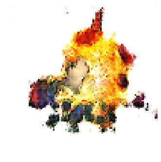  | 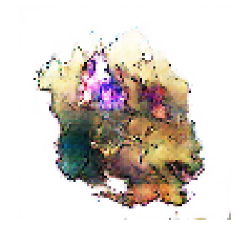  | 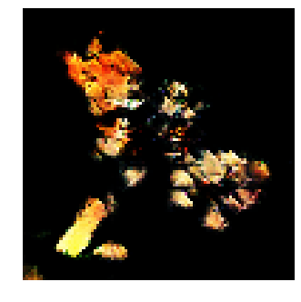  | 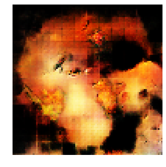  |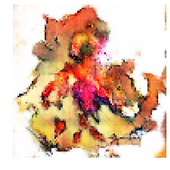  | 
|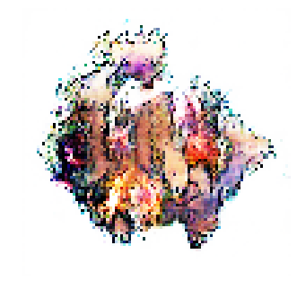  | 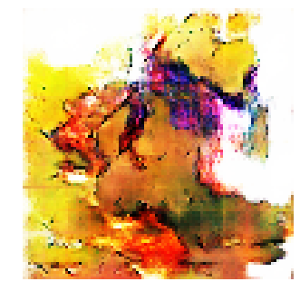  | 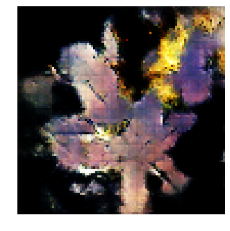  | 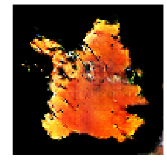  | 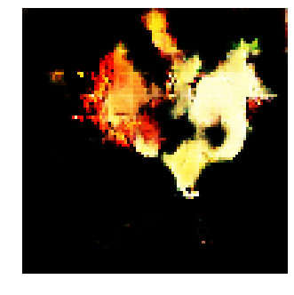  | 
|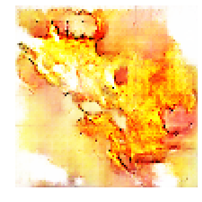  | 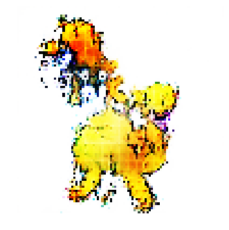  | 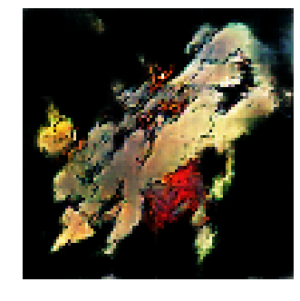  | 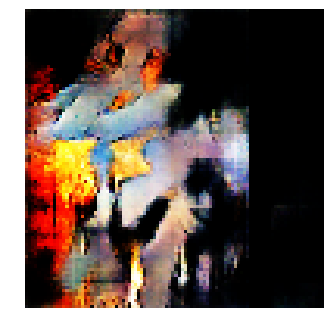  | 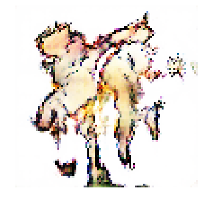  | 
|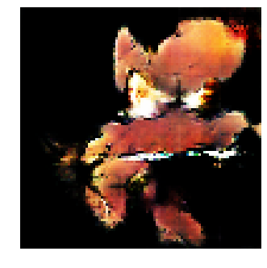  | 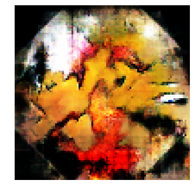  | 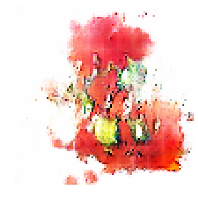  | 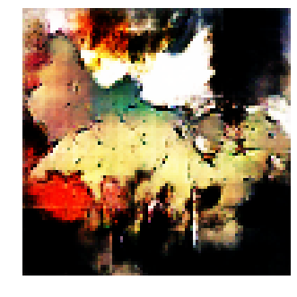  | 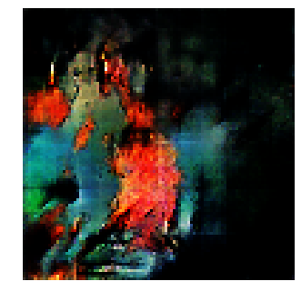  | 
|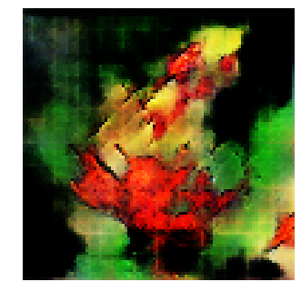  | 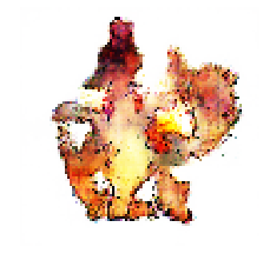  | 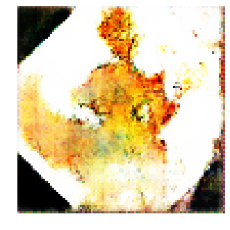  | 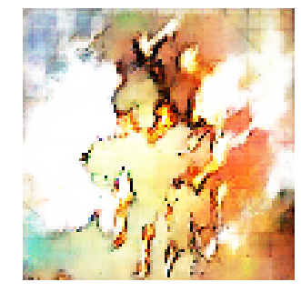  | 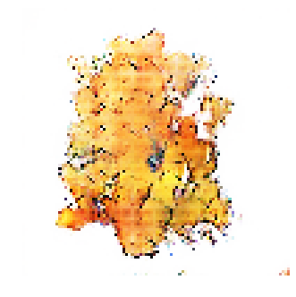  | 
